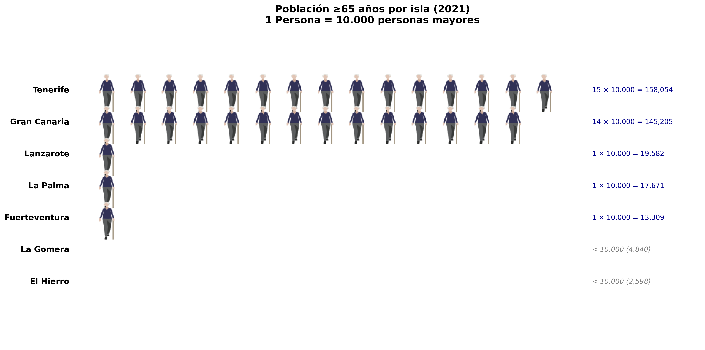
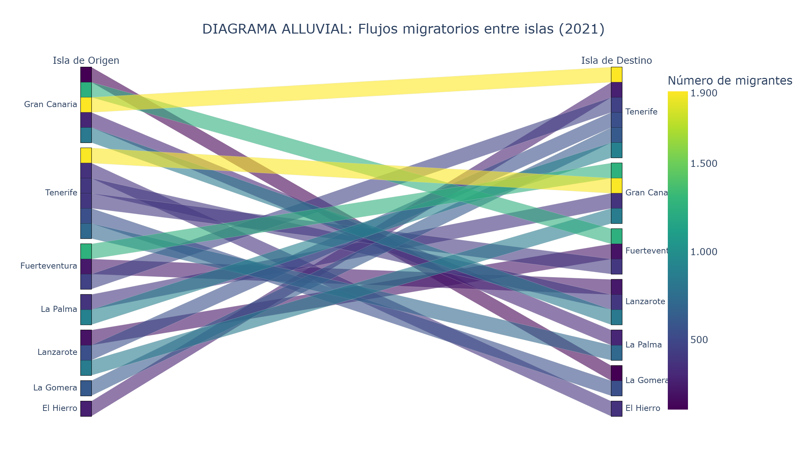

Datos: **ISTAC** – Población y migración en Canarias  

---
## 1. Isotipo
  
*1 icono = 50.000 habitantes*  
[Ver en grande](isotipo_canarias.png)

---

## 2. Diagrama Alluvial
  
*Flujo: isla → municipio (top 10 por isla)*  
[Ver en grande](alluvial_canarias.png)

---

## 3. Cartograma (Dorling - Círculos por población)
[Ver en Tableau Public](https://public.tableau.com/shared/QW9M3HSRC?:display_count=n&:origin=viz_share_link)

---

**Herramientas**: Python (Jupyter) + Tableau Public  
